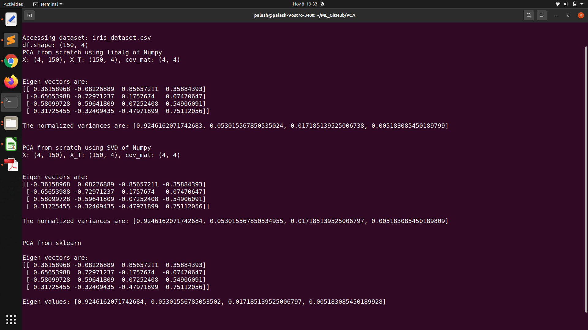

# PCA_from_scratch
It is a project where the PCA algorithm is implemented from scratch and compared with sklearn's PCA. There are three methods that are defined in PCA_.py, 
    &nbsp;&nbsp;&nbsp;&nbsp;&nbsp;&nbsp;
    * PCA_from_scratch_linalg(X): it uses np.linalg.eigen.eig() to find eigen vectors of covarience matrix created from (X*X.T) i.e. principal components of X. 
    &nbsp;&nbsp;&nbsp;&nbsp;&nbsp;&nbsp;
    * PCA_from_scratch_SVD(X): it uses np.svd(X) to find principal components of X.  
    &nbsp;&nbsp;&nbsp;&nbsp;&nbsp;&nbsp;
    * PCA_from_scratch_sklearn(X): it uses sklearn.decomposition.PCA to find principal components of X. 

 
Please find the comparisons below, 

